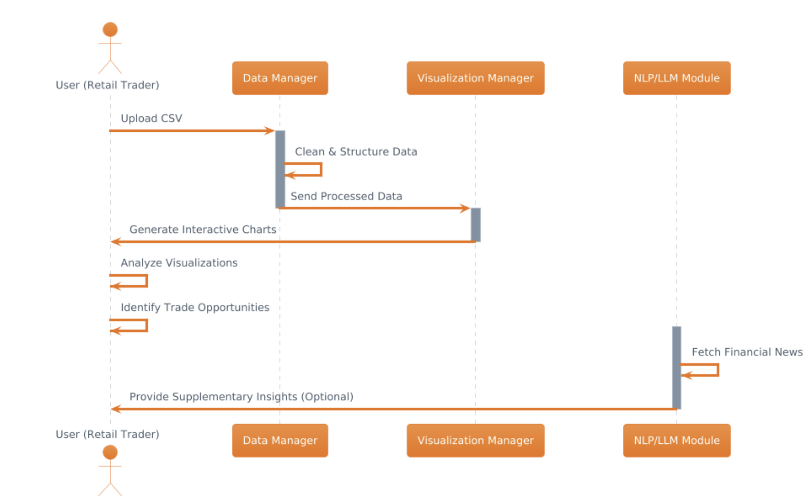

# Component Specification

## Software Components

**Data Manager**

* **Function:** Central hub for data ingestion, cleaning, preprocessing, and querying.  
* **Inputs:** CSV uploads, external API feeds, custom datasets.  
* **Outputs:** Structured data frames, query results, and preprocessed datasets ready for visualization.

**Visualization Manager**

* **Function:** Converts processed data into interactive charts, graphs, and dashboards.  
* **Inputs:** Data frames from the Data Manager and user-defined visualization parameters.  
* **Outputs:** Dynamic visual plots and graphical reports highlighting key metrics.

**NLP/LLM Integration Module**

* **Function:** Scrapes and processes external textual data to generate concise news summaries, sentiment reports, and context-aware recommendations.  
* **Inputs:** Financial news, market reports, and user queries.  
* **Outputs:** Summarized news briefs and sentiment analysis.

## Interactions to Accomplish Use Cases

### 1. Retail Trader Use Case:

* **Data Upload & Processing:**  
  The trader uploads a CSV file; the Data Manager cleanses and structures the data.  
* **Visualization & Analysis:**  
  The Visualization Manager generates interactive plots from the cleaned data, while the NLP/LLM Module adds real-time news insights.  
* **Decision Support:**  
  The trader reviews the combined visuals and news summaries to assess risk and identify trade opportunities.

**Interaction Diagram:**

### 2. Risk Assessment for Possible Strategies Use Case:

* **Data Upload & Processing:**  
  The trader uploads a CSV file; the Data Manager cleanses and structures the data.  
* **Visualization & Analysis:**  
  The Visualization Manager generates interactive plots from the cleaned data representing the profit/loss risk mark for increasingly complex strategies  
* **Decision Support:**  
  The trader reviews the profit/loss plots to determine their desired investment strategies based on their priorities and risk aversion

**Interaction Diagram:**

