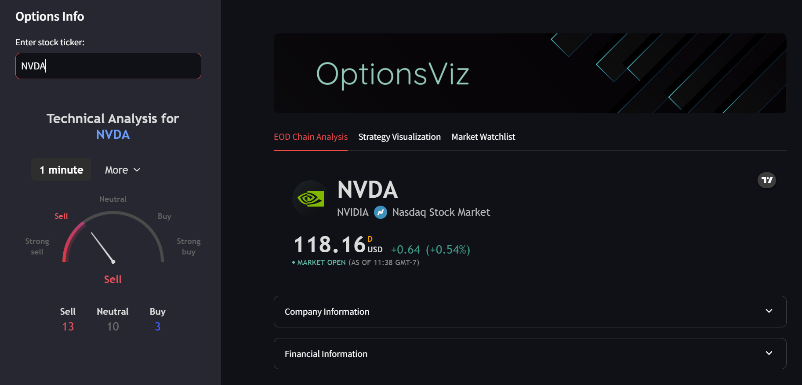
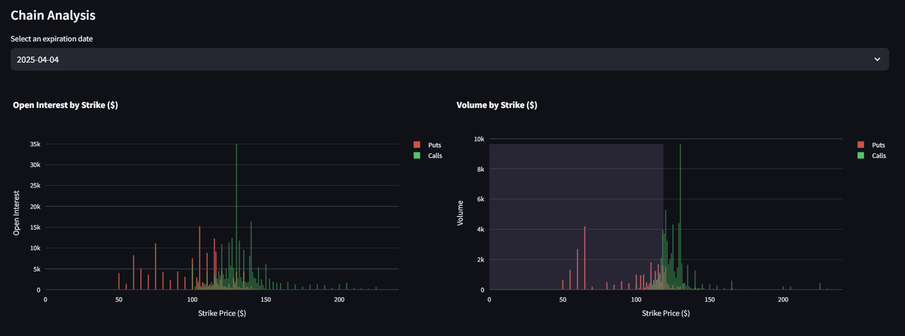
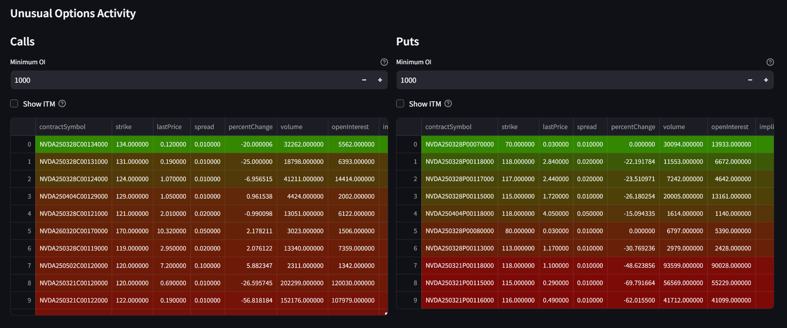
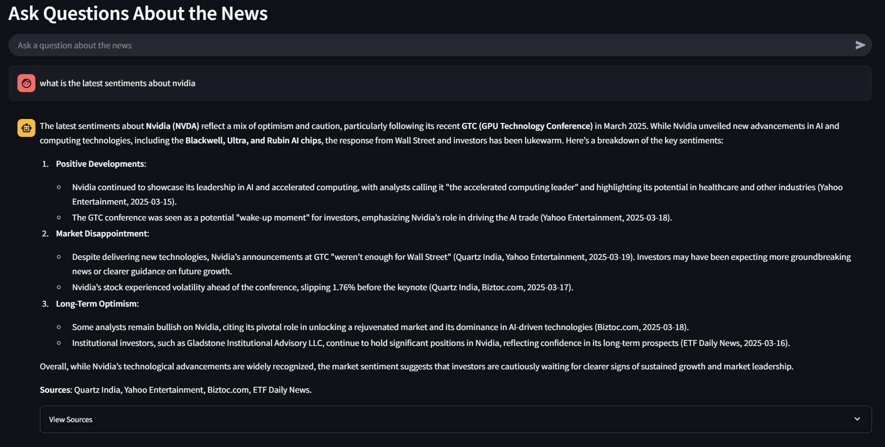
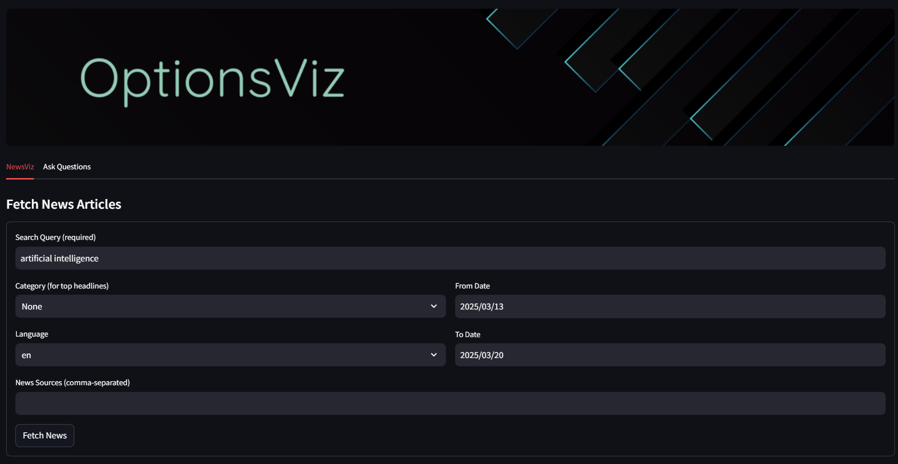
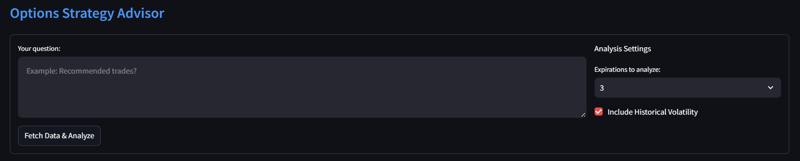

# OptionsViz

This project combines **Options Data Visualization** with an **AI-powered News Analyzer** to help traders make informed decisions. The web app enables users to:
- Visualize options chain data for different stocks
- Identify profitable strategies and manage risk
- Fetch and analyze news articles related to financial markets
- Use AI-powered search to understand news impact on options trading

## For Collaborators — How to Run/Deploy the Project

### 1. Install Prerequisites

Ensure you have the following installed:
- **Python 3.8+**
- **Conda** (for environment management)
- **Streamlit** (for web interface)
- **API Keys** (for News Retrieval & AI Analysis)
  - Pinecone API Key (for vector database)
  - NewsAPI Key
  - OpenRouter/OpenAI API Key

### 2. Clone the Repository

Clone the repository using Git:

```bash
git clone https://github.com/rrichards7/OptionsViz.git
cd OptionsViz
```

### 3. Setup Virtual Environment

Create and activate a Conda environment:

```bash
conda env create -f environment.yml
conda activate optviz
```

### 4. Configure API Keys

Create a `.env` file in the project root and add:

```ini
NEWSAPI_KEY=your_newsapi_key_here
PINECONE_API_KEY=your_pinecone_api_key_here
OPENROUTER_API_KEY=your_openrouter_api_key_here
```

### 5. Run the Application

Launch the Streamlit dashboard:

```bash
streamlit run app.py
```

This will start the app on:

```
http://localhost:8501/
```


## For Users - How to Use the Application

### Use Case 1: Options Data Visualization

**Goal**: Explore options chain data to identify trading opportunities.

**Steps to Use**:

1. Enter a stock ticker (e.g., AAPL, TSLA)
2. Click Fetch Data to load options chain data
3. View interactive charts and visualizations, including:
   - Strike Price vs. Open Interest
   - Implied Volatility vs. Expiry
   - Greeks vs. Strike Price
   - Max Pain Analysis
4. Use filters to refine your analysis:
   - Select expiration dates
   - Toggle between calls and puts

**Outcome**: Helps traders make informed decisions by visualizing liquidity, volatility, and risk exposure.








### Use Case 2: API Based News Retrieval

**Goal**: Fetch and analyze the latest financial news related to options trading.

**Steps to Use**:

1. Navigate to the News Analysis tab
2. Enter a search query (e.g., "Tesla stock forecast")
3. Filter news by:
   - Date Range
   - News Sources
   - Categories (Business, Technology, Finance, etc.)
4. Click Search to retrieve relevant news articles
5. Click on any article to view more details

**Outcome**: Get updated financial news relevant to trading decisions.



### Use Case 3: AI-Powered Market Insights

**Goal**: Use AI to extract insights from financial news.

**Steps to Use**:

1. In the AI News Search section, enter a question (e.g., "How will interest rates affect Tesla?")
2. The AI model retrieves and summarizes relevant news articles
3. Sources are displayed for fact-checking
4. Click on source links for full articles

**Outcome**: Quickly gain insights on financial trends without manually reading multiple articles.



### Use Case 4: Strategy Builder

**Goal**: Get AI-assisted trading strategies based on options data.

**Steps to Use**:

1. View calculated Greeks, IV Skew, and Put/Call Ratio
2. Ask the AI:
   - "What option strategies fit this market?"
   - "Is there unusual activity in any strikes?"
3. AI provides strategy recommendations based on data

**Outcome**: Traders receive tailored strategy insights based on real-time market data.




## Deploying to Streamlit Cloud

1. Fork and clone the repository
2. Create an account on Streamlit Cloud
3. Connect your GitHub repository and select app.py as the entry point
4. Deploy and access the app at:
   ```
   https://<your-app-name>.streamlit.app/
   ```